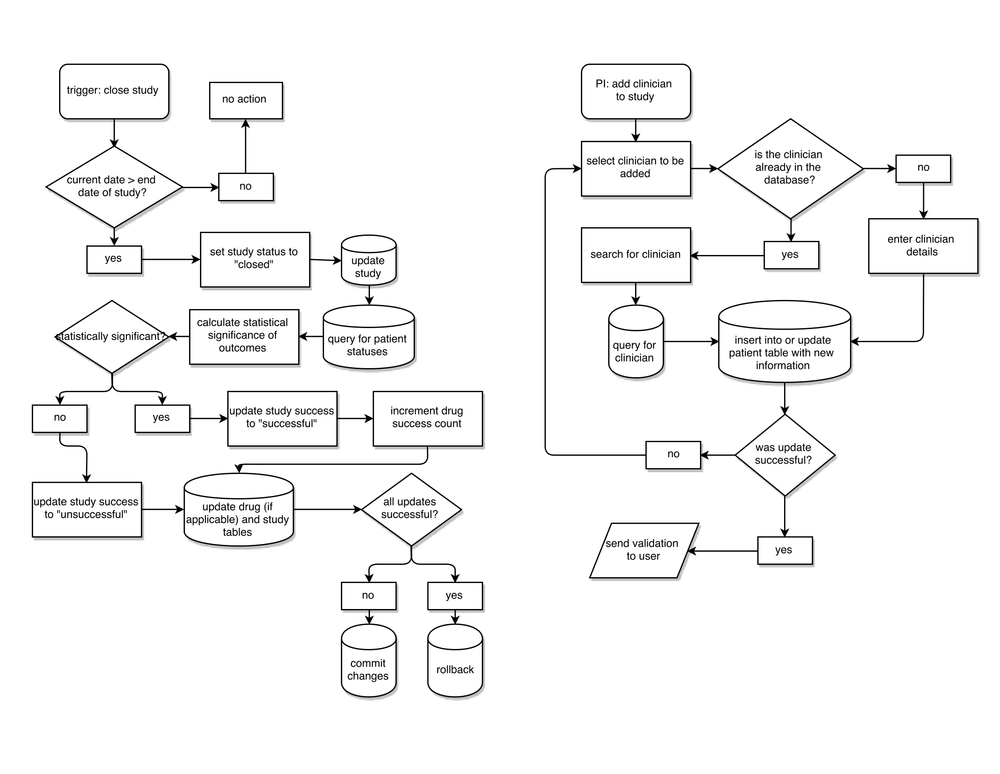

# Clinical Trial Database - Backend 

Backend component of final project for CS3200 (Database Design), Fall 2016. Built in collaboration with [Jessica Merritt](https://github.com/jessm16). Frontend component can be found [here](https://github.com/jessm16/wanmerritt-cs3200ui).

This repo consists of a REST API built on Spring Boot, which queries the AWS RDB using JDBC. 

## How to run
Load the backend application [here](https://merrittwan-cs3200.herokuapp.com/swagger-ui.html). Since the heroku project is running on free dynos, it may take up to 30 seconds to load the application for the first time. The Swagger UI shows a list of all the endpoints available through the backend API.

Front end is hosted on heroku [here](https://wanmerritt-cs3200ui.herokuapp.com/). This is also running on free dynos and may take up to 30 seconds to load for the first time. Navigate to any of the pages from the navigation bar to ensure that backend calls are being made successfully, by seeing if data is loaded from the database to the UI.

## Technologies Used
- Java 8
- Spring Boot
- JDBC MySQL connector
- Heroku
- AWS RDB
- Travis CI

## ER diagram of database

## Activity diagrams of application workflows

